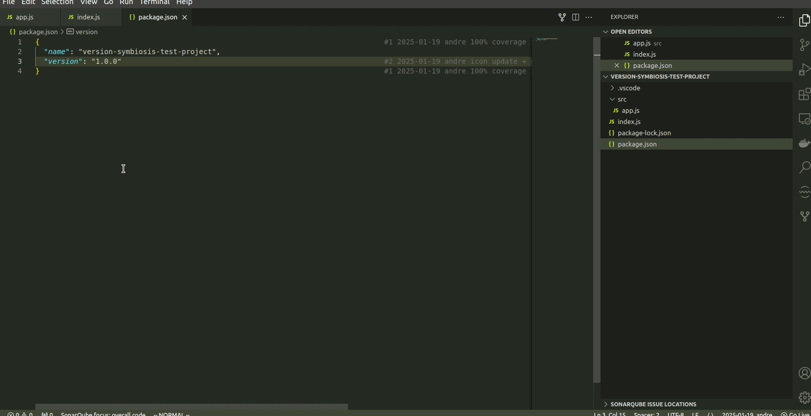
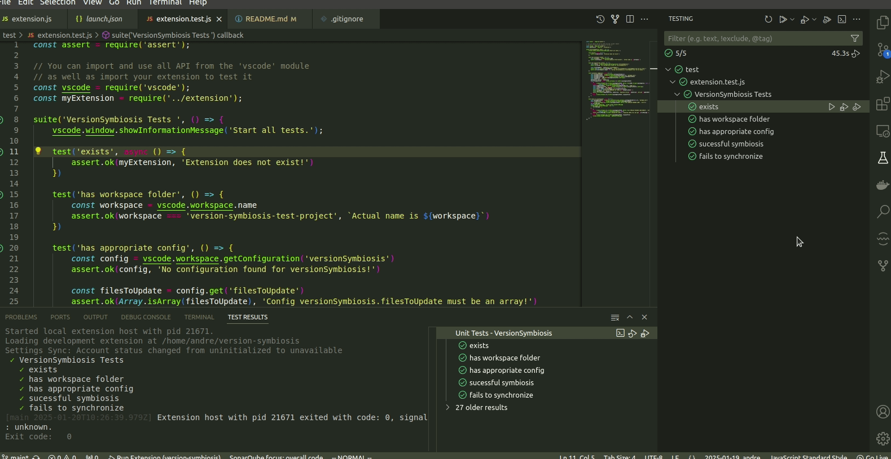

# version-symbiosis README

version-symbiosis links the version variable in package.json to other versioning files in your project.

## Features

* super simple
* syncs one versioning variable per specified file  
* never forget to update versioning variables in your project files again!

## Requirements

* version-symbiosis does not require any special dependencies to work.
* if you want to run the project locally, we recommend the `Extension Test Runner` to easily run unit tests. 
* if you want to build the extension yourself for local use, we recommend installing `vsce`

## Extension Settings

version-symbiosis contributes the following setting:

* `versionSymbiosis.filesToUpdate`: An array of objects containing `targetFile` and `targetVariable` properties.

## Known Issues

Issues are yet to be known.

## Release Notes

* We are still going through the process of registering a microsoft account so we can publish it officially.
* Meanwhile, you can install it locally from a `.vsix` file provided in the release page of this repo.
* Usage gif:

### 1.0.0

* Initial release of version-symbiosis
* Check version-symbiosis-test-project for a workspace example
* 100% unit tests coverage:

---
**Enjoy!**